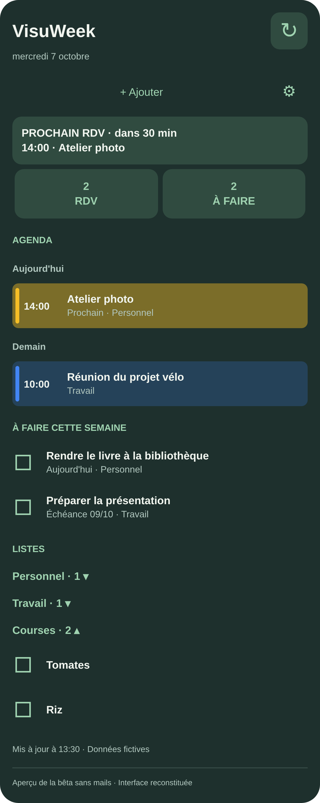
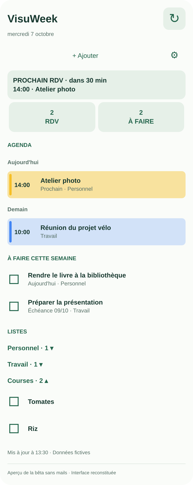

# VisuWeek

Widget Android qui regroupe les RDV Google Agenda, les tâches Google Tasks et les listes de courses sur l'écran d'accueil.

## Fonctions

- Voir les rendez-vous de la semaine et le prochain RDV.
- Cocher les tâches directement dans le widget, avec synchronisation Google Tasks.
- Voir les tâches de la semaine et celles en retard.
- Afficher les listes de tâches et de courses, et les replier selon ses besoins.
- Ajouter rapidement une tâche ou un RDV.
- Utiliser le thème clair ou sombre selon les réglages du téléphone.

## Pour qui ?

Les utilisateurs de Google Agenda et Google Tasks sur Android.

## Statut

Bêta en préparation - les infos d'installation arrivent.

Aucun APK ni code source n'est publié pour le moment.

## Aperçus

### Thème sombre

### Thème clair

Aperçus reconstitués avec des données fictives, pas des captures d'une application exécutée. La bêta présentée est prévue sans Gmail.
